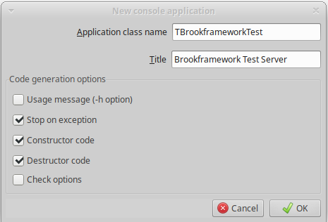

# Tutorial 1 - Brookframework

Brookframework è una libreria per FreePascal e per Delphi che consente di sviluppare server web e microservizi basati sul protocollo *http*.

La libreria internamente utilizza un'altra libreria, scritta in C, che si chiama [Sagui](https://risoflora.github.io/libsagui/).

Sagui a sua volta internamente si appoggia alla libreria GNU [Libmicrohttpd](https://www.gnu.org/software/libmicrohttpd/).

Dal sito GNU:
```
GNU libmicrohttpd is a small C library that makes it easy to run an HTTP server as part of another application. GNU Libmicrohttpd is free software and part of the GNU project.
```

## Il primo progetto in Lazarus

Iniziamo creando un piccolissimo server web.

Questo esercizio sarà utile per imparare a configurare un progetto e per muovere i primi passi con la libreria.

Apri Lazarus e crea un nuovo progetto di tipo *Applicazione console* con questi parametri:



Salva il progetto in una cartella come *TestProject.dpi*.

