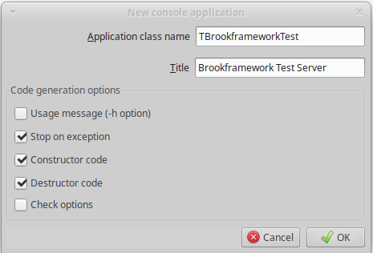

# Tutorial 1 - The Brook framework

[Brook](https://github.com/risoflora/brookframework) is a framework for FreePascal and for Delphi that allows to develop web servers and microservices based on the *http* protocol.

The library internally uses another library, written in C language, that is called [Sagui](https://risoflora.github.io/libsagui/).

Sagui, in turn, internally relies on the GNU library [Libmicrohttpd](https://www.gnu.org/software/libmicrohttpd/).

From the GNU site:
```
GNU libmicrohttpd is a small C library that makes it easy to run an HTTP server as part of another application. GNU Libmicrohttpd is free software and part of the GNU project.
```

## The first project in Lazarus

Let's start by creating a very small web service.

This exercise will be useful to learn how to configure a project and to take the first steps with the library.

Open Lazarus and create a new project of type *Console Application* with these parameters:



Save the project in a folder as *TestProject.dpi*.

Open a terminal in that folder and clone the Brook framework with the command:

```
git clone https://github.com/risoflora/brookframework.git
```

Now add the subfolder `brookframework/Source` to the project paths so that the source code of the library can be called.

Download the Sagui library from the repository: [https://github.com/risoflora/libsagui/releases](https://github.com/risoflora/libsagui/releases). Choose the most recent version (as I write this tutorial, the latest release available is *v3.5.2*).

You will obviously need to choose the package suitable for your architecture. For example, if you are developing on a PC with Linux, the right file is `libsagui-3.5.2-linux_amd64.tar.gz`, for Windows, however, you will need the package `libsagui-3.5.2-windows_amd64.zip`.

For Windows, it will be sufficient to copy the contents of the zip file into the folder where the project is saved.

In Linux you will need to execute these commands:
```
sudo cp libsagui.so.3.5.2 /usr/lib
cd /usr/lib
sudo ln -s libsagui.so.3.5.2 libsagui.so.3
```

### Let's finally move on to the code...

The web services built using the Brook framework rely on 2 pillars:
  * the first pillar is the class `TBrookHTTPServer`  which represents the heart of the web service: it is the container of a series of fundamental parameters, such as the port on which the service will be exposed, and has an `Open` method to activate the web service;
  * the class `TBrookURLRoute` from which several child classes should be derived: one for each route that we want to implement to organize the APIs of our web service. An instance of each of these classes must be created during the setup of the web service and then added to the instance of the class `TBrookURLRouter` to which the orchestration of routing will be delegated when the web service is active.


For this first project, we want to use a single route: `/ping`.

So add a new unit `routeping` to the project and define a new class derived from `TBrookURLRoute`:

``` pascal
TRoutePing = class(TBrookURLRoute)
protected
  procedure DoRequest(ASender: TObject; ARoute: TBrookURLRoute; ARequest: TBrookHTTPRequest; AResponse: TBrookHTTPResponse); override;
public
    procedure AfterConstruction; override;
end;
```

The `AfterConstruction` method defines the parameters of the route. We want our route to respond only to *GET* type http calls when the path */ping* is requested:

``` pascal
procedure TRoutePing.AfterConstruction;
begin
  Methods:= [rmGET];
  Pattern:= '/ping';
end;
```

The router, when the match with one of the defined routes is positive, will execute the corresponding `DoRequest` method which in our example will be: 

``` pascal
procedure TRoutePing.DoRequest(ASender: TObject; ARoute: TBrookURLRoute; ARequest: TBrookHTTPRequest; AResponse: TBrookHTTPResponse);
begin
  AResponse.Send('<html><head><title>Ping</title></head><body>Pong</body></html>', 'text/html; charset=utf-8', 200);
end; 
```

Add a new unit `httpserver` to the project and define a new class derived from `TBrookHTTPServer`:

``` pascal
  THTTPServer = class(TBrookHTTPServer)
  private
    FRouter : TBrookURLRouter;
  protected
    procedure DoRequest(ASender: TObject; ARequest: TBrookHTTPRequest;
      AResponse: TBrookHTTPResponse); override;
  public
    constructor Create(AOwner: TComponent); override;

    procedure SetupServer;
  end;
```

This class is responsible for bringing together everything: the components of the Brook framework and the routes defined in the project, so insert this code in the constructor:

``` pascal
constructor THTTPServer.Create(AOwner: TComponent);
var
  rp : TRoutePing;
begin
  inherited Create(AOwner);
  FRouter := TBrookURLRouter.Create(Self);
  rp := TRoutePing.Create(FRouter.Routes);
  FRouter.Active := true;
end;
```

The constructor creates an instance of the framework's router and loads the defined routes into it. The ownership of the routes is passed to the router itself, so we do not have to worry about calling Free on them.

The `DoRequest` method of the class is the one called by the framework to respond to calls. In our example, it can function as a simple pass-through:

``` pascal
procedure THTTPServer.DoRequest(ASender: TObject; ARequest: TBrookHTTPRequest; AResponse: TBrookHTTPResponse);
begin
  FRouter.Route(ASender, ARequest, AResponse);
end; 
```

The `SetupServer` method will be useful for initializing the connection parameters:

``` pascal
procedure THTTPServer.SetupServer;
begin
  Self.Port := 8080;
end; 
```

Now it is sufficient to insert in the application code the creation and activation of the server just created:

``` pascal
procedure TBrookframeworkTest.DoRun;
var
  server: THTTPServer;
begin
  server := THTTPServer.Create(nil);
  try
    server.SetupServer;
    server.Open;
    if not server.Active then
    begin
      WriteLn('Unable to start server at http://localhost:', server.Port);
      Terminate(-1);
    end
    else
    begin
      WriteLn('Server running at http://localhost:', server.Port);
      ReadLn;
    end;
  finally
    server.Free;
  end;
  Terminate;
end; 
```

Run the project and try to connect with the browser to the address http://localhost:8080/ping. What you should see is:


The server is working and has correctly responded to the browser's request.

### Everything must be encrypted!

Nowadays, connections should all be encrypted, so let's see how to turn our http server into an https one.

The first step to take is to obtain a self-signed ssl certificate.

Open a shell in the project folder and type the following command (openssl must be installed on your system):

```
openssl req -x509 -nodes -days 1000 -newkey rsa:2048 -keyout self_signed_key.pem -out self_signed.pem
```

It will also be necessary to obtain the version of the Sagui library with tls support. The repository, as we saw earlier, is [https://github.com/risoflora/libsagui/releases](https://github.com/risoflora/libsagui/releases), this time the archive `libsagui_tls-3.5.2-linux_amd64.tar.gz` for linux or `libsagui_tls-3.5.2-windows_amd64.zip` for Windows should be downloaded. The previously described deployment operations should then be repeated.

If you are using Windows, you will also need to install the DLLs from the `gnutls` library. At the time of writing, the latest available version for 64-bit Windows can be downloaded from here: [https://github.com/risoflora/libsagui/releases/download/v3.5.1/gnutls-3.8.6-mingw_amd64.zip](https://github.com/risoflora/libsagui/releases/download/v3.5.1/gnutls-3.8.6-mingw_amd64.zip). Again, the contents of the zip file should be copied into the folder where the project is saved.

Once the certificate is generated and the library is set up, we can focus on the code modifications.

The procedure that sets up the `THTTPServer` class should be modified as follows:

``` pascal
procedure THTTPServer.SetupServer;
var
  lst : TStringList;
begin
  Self.Port := 443;

  lst := TStringList.Create;
  try
    lst.LoadFromFile('self_signed.pem');
    Self.Security.Certificate:= lst.Text;
    lst.LoadFromFile('self_signed_key.pem');
    Self.Security.PrivateKey:= lst.Text;
    Self.Security.Active:= true;
  finally
    lst.Free;
  end;
end;
```

At the code level, this is all that is needed. Rerun the program and try to open the address https://localhost/ping in the browser.

It will be necessary to add a security exception in the browser, the certificate is self-signed and therefore no one can guarantee its authenticity, but once this is done, what you should see is:


In the wiki of the Brook framework, it is described how to use a real certificate on a Windows server connected to the internet: https://github.com/risoflora/brookframework/wiki/How-to-configure-TLS-in-Brook-5-Framework-on-a-Microsoft-Windows-Server

## What we have seen
  * how to set up a project that uses the Brook framework
  * how to create a simple service that responds to an http call
  * how to implement the same service using https

## Where to find the source code
Full source code of this tutorial is available at: [https://github.com/DomenicoMammola/brookframework_tutorials](https://github.com/DomenicoMammola/brookframework_tutorials)
  