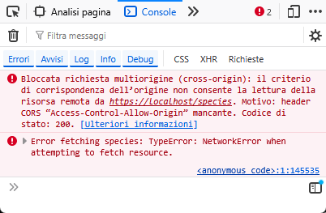

# Tutorial 2 - Un server CRUD con il framework Brook

Sviluppiamo insieme un server CRUD utilizzando la libreria Brook.

La configurazione dell'ambiente di sviluppo è già stata descritta nel Tutorial 1.

## Adotta un animaletto alieno

Costruiremo le api per gestire un'agenzia di adozione di animaletti alieni.

Ogni animaletto avrà un nome, scelto dall'utente, ed una specie, scelta invece da un elenco di tre.

### Iniziamo a scrivere il codice...

Crea un nuovo progetto seguendo le indicazioni presenti nel Tutorial 1 e poi aggiungi al progetto una nuova unit: `modulealienpets`.

La prima route di cui avremo bisogno è quella che ci consentirà di compilare la tendina delle specie disponibili. La route risponderà ad una chiamata GET al percorso `/species`.

Nella unit aggiungi la classe `TRouteSpecies`:

``` pascal
  TRouteSpecies = class(TBrookURLRoute)
  protected
    procedure DoRequest(ASender: TObject; ARoute: TBrookURLRoute; ARequest: TBrookHTTPRequest; AResponse: TBrookHTTPResponse); override;
  public
    procedure AfterConstruction; override;
  end; 
```

ed implementa così i due metodi:

``` pascal
procedure TRouteSpecies.DoRequest(ASender: TObject; ARoute: TBrookURLRoute; ARequest: TBrookHTTPRequest; AResponse: TBrookHTTPResponse);
begin
 AResponse.Send('["Zog", "Gleep", "Bloop"]', 'application/json; charset=utf-8', 200);
end;

procedure TRouteSpecies.AfterConstruction;
begin
  Methods:= [rmGET];
  Pattern:= '/species';
end; 
```

Aggiungi la unit `httpserver` e crea una classe derivata da `TBrookHTTPServer` come già visto nel precedente tutorial. Nel costruttore del server andrà caricata la route `TRouteSpecies`.

Eseguendo il progetto e visitando l'url `https://localhost/species` questo sarà il risultato:


Funziona! Proviamo allora ad utilizzarlo dentro una pagina web di test che salveremo in un file `test.html`:

``` html
<!DOCTYPE html>
<html lang="en">
<body>
    <ul id="list">
    </ul> 
</body>
<script>
async function fetchSpecies() {
    try {
        const response = await fetch('https://localhost/species');
        if (!response.ok) {
            throw new Error('Network not working');
        }
        const species = await response.json();
        populateSpeciesList(species);
    } catch (error) {
        console.error('Error fetching species:', error);
    }
}

function populateSpeciesList(species) {
    const ul = document.getElementById('list');
    species.forEach(speciesItem => {
        const li = document.createElement("li");
        li.appendChild(document.createTextNode(speciesItem));
        ul.appendChild(li);
    });
}

fetchSpecies();

</script>
```

Aprendo il file nel browser quello che otterremo sarà una pagina vuota!

Uno sguardo alla console di sviluppo del browser basterà per rendersi conto che il problema sono i controlli del browser sui criteri cross-origin:




### COOOOORRRRS!

Nel nostro server non abbiamo gestito le chiamate [CORS](https://en.wikipedia.org/wiki/Cross-origin_resource_sharing).

Se vogliamo che le api del nostro server siano accessibili da pagine che non provengono dal server stesso, come avviene con il nostro file `test.html` o come avverrebbe durante l'attività di sviluppo con Node.js e un framework come React, dovremo autorizzare le chiamate cors (magari con l'aiuto di una bella *define* fatta ad hoc se cors ci serve solo durante lo sviluppo).

Aggiungi una nuova unit `standardheaders` al progetto e definisci questa funzione:

``` pascal
procedure AddStandardHeaders(AResponse: TBrookHTTPResponse);
begin
  //{$IFDEF DEVELOPMENT}
  AResponse.Headers.Add('Access-Control-Allow-Origin', '*');
  //{$ENDIF}
end;
```

L'header inserito è proprio quello che serve per comunicare al browser che il nostro server è disposto a servire chiamate cross-origin.

Puoi utilizzare questa funzione per inserire altri header che potrebbero essere utili, ad esempio: 
``` pascal
AResponse.Headers.Add('Server', 'Alien puppies server');
```

Modifica la route:

``` pascal
procedure TRouteSpecies.DoRequest(ASender: TObject; ARoute: TBrookURLRoute; ARequest: TBrookHTTPRequest; AResponse: TBrookHTTPResponse);
begin
  AddStandardHeaders(aResponse);
  AResponse.Send('["Zog", "Gleep", "Bloop"]', 'application/json; charset=utf-8', 200);
end; 
```

Ora esegui il progetto e ricarica `test.html` nel broser, quello che vedrai è:

