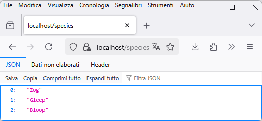

# Tutorial 2 - Un server CRUD con il framework Brook

Sviluppiamo insieme un server CRUD utilizzando la libreria Brook.

La configurazione dell'ambiente di sviluppo è già stata descritta nel Tutorial 1.

## Adotta un animaletto alieno

Costruiremo le api per gestire un'agenzia di adozione di animaletti alieni.

Ogni animaletto avrà un nome, scelto dall'utente, ed una specie, scelta invece da un elenco di tre.

### Iniziamo a scrivere il codice...

Crea un nuovo progetto seguendo le indicazioni presenti nel Tutorial 1 e poi aggiungi al progetto una nuova unit: `modulealienpets`.

La prima route di cui avremo bisogno è quella che ci consentirà di compilare la tendina delle specie disponibili. La route risponderà ad una chiamata GET al percorso `/species`.

Nella unit aggiungi la classe `TRouteSpecies`:

``` pascal
  TRouteSpecies = class(TBrookURLRoute)
  protected
    procedure DoRequest(ASender: TObject; ARoute: TBrookURLRoute; ARequest: TBrookHTTPRequest; AResponse: TBrookHTTPResponse); override;
  public
    procedure AfterConstruction; override;
  end; 
```

ed implementa così i due metodi:

``` pascal
procedure TRouteSpecies.DoRequest(ASender: TObject; ARoute: TBrookURLRoute; ARequest: TBrookHTTPRequest; AResponse: TBrookHTTPResponse);
begin
 AResponse.Send('["Zog", "Gleep", "Bloop"]', 'application/json; charset=utf-8', 200);
end;

procedure TRouteSpecies.AfterConstruction;
begin
  Methods:= [rmGET];
  Pattern:= '/species';
end; 
```

Aggiungi la unit `httpserver` e crea una classe derivata da `TBrookHTTPServer` come già visto nel precedente tutorial. Nel costruttore del server andrà caricata la route `TRouteSpecies`.

Eseguendo il progetto e visitando l'url `https://localhost/species` questo sarà il risultato:



Funziona! Proviamo allora ad utilizzarlo dentro una pagina web di test che salveremo in un file `test.html`:

``` html
<!DOCTYPE html>
<html lang="en">
<body>
    <ul id="list">
    </ul> 
</body>
<script>
async function fetchSpecies() {
    try {
        const response = await fetch('https://localhost/species');
        if (!response.ok) {
            throw new Error('Network not working');
        }
        const species = await response.json();
        populateSpeciesList(species);
    } catch (error) {
        console.error('Error fetching species:', error);
    }
}

function populateSpeciesList(species) {
    const ul = document.getElementById('list');
    species.forEach(speciesItem => {
        const li = document.createElement("li");
        li.appendChild(document.createTextNode(speciesItem));
        ul.appendChild(li);
    });
}

fetchSpecies();

</script>
```

Aprendo il file nel browser quello che otterremo sarà una pagina completamente vuota!

Uno sguardo alla console di sviluppo del browser basterà per rendersi conto che il problema sono i controlli del browser sui criteri cross-origin:


### COOOOORRRRS!


Nel nostro server non abbiamo gestito le chiamate [CORS](https://en.wikipedia.org/wiki/Cross-origin_resource_sharing).

Se vogliamo che le api del nostro server siano accessibili da pagine che non provengono dal server stesso, come avviene con il nostro file `test.html` o come avverrebbe durante l'attività di sviluppo con Node.js e un framework come React, dovremo autorizzare le chiamate cors (magari con l'aiuto di una bella *define* fatta ad hoc se cors ci serve solo durante lo sviluppo).

Aggiungi una nuova unit `standardheaders` al progetto e definisci questa funzione:

``` pascal
procedure AddStandardHeaders(AResponse: TBrookHTTPResponse);
begin
  //{$IFDEF DEVELOPMENT}
  AResponse.Headers.Add('Access-Control-Allow-Origin', '*');
  //{$ENDIF}
end;
```

L'header inserito è proprio quello che serve per comunicare al browser che il nostro server è disposto a servire chiamate cross-origin.

Puoi utilizzare questa funzione per inserire altri header che potrebbero essere utili, ad esempio: 
``` pascal
AResponse.Headers.Add('Server', 'Alien puppies server');
```

Modifica la route:

``` pascal
procedure TRouteSpecies.DoRequest(ASender: TObject; ARoute: TBrookURLRoute; ARequest: TBrookHTTPRequest; AResponse: TBrookHTTPResponse);
begin
  AddStandardHeaders(aResponse);
  AResponse.Send('["Zog", "Gleep", "Bloop"]', 'application/json; charset=utf-8', 200);
end; 
```

Ora esegui il progetto e ricarica `test.html` nel broser, quello che vedrai è:


Benissimo! Finito col CORS? No.

L'header aggiunto è sufficiente ma solo se le chiamate CORS sono del  cosiddetto tipo [simple](https://developer.mozilla.org/en-US/docs/Web/HTTP/Guides/CORS#simple_requests). Purtroppo è necessario gestire richieste che il browser cataloga come [preflighted](https://developer.mozilla.org/en-US/docs/Web/HTTP/Guides/CORS#preflighted_requests) e quindi implementare la gestione del metodo http *OPTIONS*.

Facciamo una prova: cambia la porta del servizio da 443 a 5443 sia nel codice pascal sia nella pagina `test.html`. La chiamata diventerà preflighted ed il browser inizierà ad invocare il metodo OPTIONS. L'utilizzo di una porta diversa dallo standard è solo uno dei motivi per cui il browser può decidere di utilizzare la chiamata OPTIONS. Ce ne sono molti purtroppo.

Per risparmiarci mal di testa, implementiamo subito quanto manca per domare totalmente i criteri cors.

Riapri la unit `standardheaders` ed inserisci questa nuova procedura che aggiunge gli header necessari a soddisfare il browser nella risposta al metodo OPTIONS:

``` pascal
procedure AddStandardHeadersForOptions(AResponse: TBrookHTTPResponse; ARoute: TBrookURLRoute);
var
  mt, sep : String;
begin
  AddStandardHeaders(AResponse);

  if ARoute.Methods = [] then
    mt := 'GET, PUT, POST, OPTIONS, HEAD'
  else
  begin
    mt := '';
    sep  := '';
    if rmGet in ARoute.Methods then
    begin
      mt := mt + sep + 'GET';
      sep := ', ';
    end;
    if rmPOST in ARoute.Methods then
    begin
      mt := mt + sep + 'POST';
      sep := ', ';
    end;
    if rmPUT in ARoute.Methods then
    begin
      mt := mt + sep + 'PUT';
      sep := ', ';
    end;
    if rmDELETE in ARoute.Methods then
    begin
      mt := mt + sep + 'DELETE';
      sep := ', ';
    end;
    if rmPATCH in ARoute.Methods then
    begin
      mt := mt + sep + 'PATCH';
      sep := ', ';
    end;
    if rmOPTIONS in ARoute.Methods then
    begin
      mt := mt + sep + 'OPTIONS';
      sep := ', ';
    end;
    if rmHEAD in ARoute.Methods then
    begin
      mt := mt + sep + 'HEAD';
      sep := ', ';
    end;
  end;

  AResponse.Headers.Add('Access-Control-Allow-Methods', mt);
  AResponse.Headers.Add('Access-Control-Allow-Headers', 'x-requested-with, content-type, authorization');
end;
```

Ora aggiungi una nuova unit al progetto: `standardresponses`.

Dentro questa unit definisci il seguente metodo che ci sarà utile per evitare di riscrivere lo stesso codice in tutte le route:

``` pascal
function HandleOptions(ARequest : TBrookHTTPRequest; AResponse: TBrookHTTPResponse; ARoute : TBrookURLRoute): boolean;
begin
  Result := false;
  if ARequest.Method = 'OPTIONS' then
  begin
    AddStandardHeadersForOptions(AResponse, ARoute);
    AResponse.Send('', 'text/html', 200);
    Result := true;
  end;
end; 
```

Quasi finito... ora torna al codice della route `\species` e modifica il metodo `AfterConstruction` aggiungendo il metodo OPTIONS a quelli consentiti:
``` pascal
  Methods:= [rmGET, rmOPTIONS];
```

Modifica anche la funzione `DoRequest` in modo da aggiungere la gestione del metodo OPTIONS:
``` pascal
procedure TRouteSpecies.DoRequest(ASender: TObject; ARoute: TBrookURLRoute; ARequest: TBrookHTTPRequest; AResponse: TBrookHTTPResponse);
begin
  if HandleOptions(ARoute, ARequest, AResponse) then
    exit;
  AddStandardHeaders(aResponse);
  AResponse.Send('["Zog", "Gleep", "Bloop"]', 'application/json; charset=utf-8', 200);
end;  
```

Finito! Lancia il server e ricarica `test.html`: la pagina è tornata a funzionare anche con il servizio spostato sulla porta 5443.

## Finalmente crud

Aggiungi una nuova unit `alienpets` al progetto.

Nella unit definisci un nuovo tipo che ci servirà per rappresentare il singolo animaletto alieno (l'implementazione dei metodi non è volutamente riportata perchè dovrebbe essere piuttosto semplice):

``` pascal
  TAlienPet = class
  strict private
    FId : integer;
    FName : string;
    FSpecies : string;
  public
    constructor Create;
    procedure Clear;
    procedure Assign(const aSource : TAlienPet);
    procedure FromJson (aJsonData : TJSONData); overload;
    procedure FromJson (const aJsonString : string); overload;
    function ToJson: String; 

    property Id : integer read FId write FId;
    property Name : string read FName write FName;
    property Species : string read FSpecies write FSpecies;
  end; 
  ```

Devi anche creare una classe per memorizzare un elenco di animaletti che utilizzeremo nel server come repository in memoria degli animaletti. Proprio per questo dovrai proteggere le operazioni di lettura/scrittura con una critical section e i metodi Get* devono restituire una copia dell'istanza originale:

``` pascal
  TAlienPetsArchive = class
  strict private
    FList : TObjectList;
    FCriticalSection : TCriticalSection;
    FLastId : integer;
    function Get(const aIndex : integer): TAlienPet;
  public
    constructor Create;
    destructor Destroy; override;
    function ToJson: String; // convert the archive to a json string

    procedure Add(const aAlienPet : TAlienPet); // add a pet to the archive
    procedure Delete (const aId : integer); // delete a pet from the archive by its own id
    procedure Update(const aSourceAlienPet : TAlienPet); // update a pet in the archive
    function GetNewId : integer; // generate a new unique id (for a newly created pet)
  end;


```

Ora riapri `modulealienpets` perchè è il momento di creare una nuova route per recuperare gli animaletti disponibili.

Aggiungi sotto ad *implementation* la definizione di una nuova variabile globale di tipo `TAlienPetsArchive`:

``` pascal
var
  pets : TAlienPetsArchive;   
```

Aggiungi una funzione di comodo per inserire alcuni valori di test:

``` pascal
procedure InitAlienPetsArchive;
var
  tmp : TAlienPet;
begin
  tmp := TAlienPet.Create;
  tmp.Id:= 1;
  tmp.Name:= 'Prootelon';
  tmp.Species:= 'Zog';
  pets.Add(tmp);

  tmp := TAlienPet.Create;
  tmp.Id:= 2;
  tmp.Name:= 'Bidibop';
  tmp.Species:= 'Bloop';
  pets.Add(tmp);

  tmp := TAlienPet.Create;
  tmp.Id:= 3;
  tmp.Name:= 'Sguish';
  tmp.Species:= 'Gleep';
  pets.Add(tmp);
end; 
```

ed crea e distruggi il nostro archivio nelle sezioni *initialization* e *finalization* della unit:

``` pascal
initialization
  pets := TAlienPetsArchive.Create;
  InitAlienPetsArchive;

finalization
  pets.Free;  
```

Così avremo a disposizione un repository di animaletti alieni in memoria e qualche valore precaricato per iniziare subito a vedere qualcosa.

Ora aggiungi una nuova route alla unit:

``` pascal
  TRoutePetAliens = class(TBrookURLRoute)
  protected
    procedure DoRequest(ASender: TObject; ARoute: TBrookURLRoute; ARequest: TBrookHTTPRequest; AResponse: TBrookHTTPResponse); override;
  public
    procedure AfterConstruction; override;
  end; 
```

Questa route risponderà al percorso `/alienpets` restituendo l'elenco degli animaletti presenti in quel momento nel repository:

``` pascal
procedure TRoutePetAliens.DoRequest(ASender: TObject; ARoute: TBrookURLRoute; ARequest: TBrookHTTPRequest; AResponse: TBrookHTTPResponse);
begin
  if HandleOptions(ARoute, ARequest, AResponse) then
    exit;
  AddStandardHeaders(AResponse);
  AResponse.Send('{"pets":' + pets.ToJson + '}', 'application/json', 200);
end;

procedure TRoutePetAliens.AfterConstruction;
begin
  Methods:= [rmGET, rmOPTIONS];
  Pattern:= '/alienpets';
end; 
```

Siamo pronti per imbastire la pagina della nostra agenzia di adozione!

Crea un file `index.html` fatto così:

``` html
<!DOCTYPE html>
<html lang="en">

<head>
    <meta charset="UTF-8">
    <meta name="viewport" content="width=device-width, initial-scale=1.0">
    <title>Alien Pet Adoption Agency</title>
    <style>
        body {
            font-family: Arial, sans-serif;
            background-color: #f0f8ff;
            margin: 0;
            padding: 20px;
        }

        h1 {
            color: #4b0082;
        }

        table {
            width: 100%;
            border-collapse: collapse;
            margin-top: 20px;
        }

        th,
        td {
            border: 1px solid #ddd;
            padding: 8px;
            text-align: left;
        }

        th {
            background-color: #4b0082;
            color: white;
        }

        button {
            margin-top: 10px;
        }
    </style>
</head>

<body>
    <h1>Alien Pet Adoption Agency</h1>

    <h2>Available Alien Pets</h2>
    <table id="petList">
        <thead>
            <tr>
                <th>Id</th>                
                <th>Name</th>
                <th>Species</th>                
                <th>Actions</th>
            </tr>
        </thead>
        <tbody>
            <!-- Pet items will be dynamically added here -->
        </tbody>
    </table>

    <script>
        const apiUrl = "https://localhost";               
        
        function displayPets(petsList) {
            const petList = document.getElementById('petList').getElementsByTagName('tbody')[0];
            petList.innerHTML = ''; // Clear existing pets
            petsList.pets.forEach((pet, index) => {
                const row = petList.insertRow();
                row.insertCell(0).innerText = pet.id;
                row.insertCell(1).innerText = pet.name;
                row.insertCell(2).innerText = pet.species;                
                row.insertCell(3).innerText = "todo";
            });
        }

        async function fetchPets() {
            try {
                const response = await fetch(apiUrl + "/alienpets", { mode: 'cors' });
                if (!response.ok) {
                    throw new Error('Network response was not ok');
                }
                const pets = await response.json();                
                displayPets(pets);
            } catch (error) {
                console.error('Error fetching species:', error);
            }
        }
        
        fetchPets();
    </script>
</body>
</html>
```

Attiva il server e carica il file nel browser, questo è quello che apparirà:


