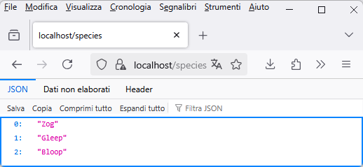
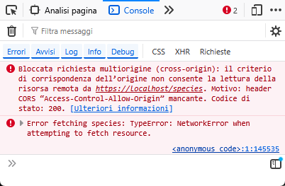
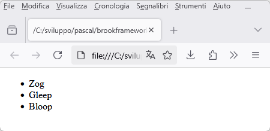
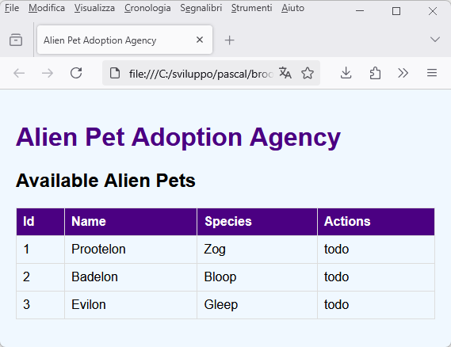
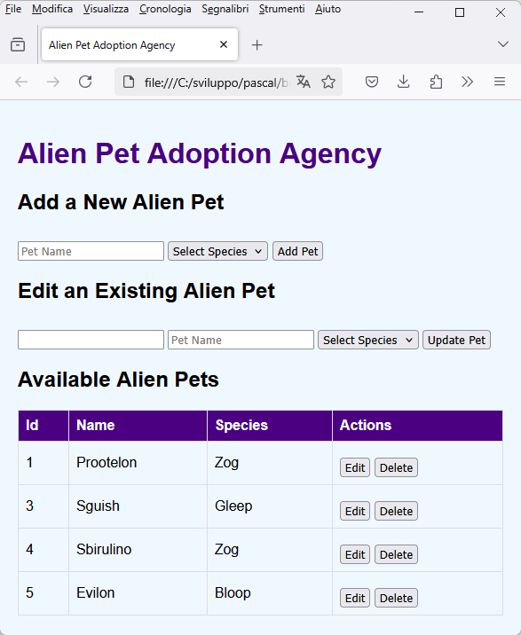

# Tutorial 2 - A CRUD server with the Brook framework

Let's develop a CRUD server together using the Brook library.

The development environment setup has already been described in Tutorial 1.

## Adopt an alien pet

We will build the APIs to manage an adoption agency for alien pets.

Each pet will have a name, chosen by the user, and a species, chosen from a list of three.

### Let's start writing the code...

Create a new project following the instructions in Tutorial 1 and then add a new unit to the project: `modulealienpets`.

The first route we will need is the one that will allow us to populate the dropdown of available species. The route will respond to a GET request at the path `/species`.

In the unit, add the class `TRouteSpecies`:

``` pascal
  TRouteSpecies = class(TBrookURLRoute)
  protected
    procedure DoRequest(ASender: TObject; ARoute: TBrookURLRoute; ARequest: TBrookHTTPRequest; AResponse: TBrookHTTPResponse); override;
  public
    procedure AfterConstruction; override;
  end; 
```

and implement the two methods like this:

``` pascal
procedure TRouteSpecies.DoRequest(ASender: TObject; ARoute: TBrookURLRoute; ARequest: TBrookHTTPRequest; AResponse: TBrookHTTPResponse);
begin
 AResponse.Send('["Zog", "Gleep", "Bloop"]', 'application/json; charset=utf-8', 200);
end;

procedure TRouteSpecies.AfterConstruction;
begin
  Methods:= [rmGET];
  Pattern:= '/species';
end; 
```

Add the unit `httpserver` and create a class derived from `TBrookHTTPServer` as already seen in the previous tutorial. In the server constructor, the route `TRouteSpecies` must be loaded.

By running the project and visiting the URL `https://localhost/species`, this will be the result:



It works! Let's try to use it inside a test web page that we will save in a file `test.html`:

``` html
<!DOCTYPE html>
<html lang="en">
<body>
    <ul id="list">
    </ul> 
</body>
<script>
async function fetchSpecies() {
    try {
        const response = await fetch('https://localhost/species');
        if (!response.ok) {
            throw new Error('Network not working');
        }
        const species = await response.json();
        populateSpeciesList(species);
    } catch (error) {
        console.error('Error fetching species:', error);
    }
}

function populateSpeciesList(species) {
    const ul = document.getElementById('list');
    species.forEach(speciesItem => {
        const li = document.createElement("li");
        li.appendChild(document.createTextNode(speciesItem));
        ul.appendChild(li);
    });
}

fetchSpecies();

</script>
```

Opening the file in the browser, what we will get is a completely empty page!

A glance at the browser's development console will be enough to realize that the problem is the browser's checks on cross-origin criteria:




### COOOOORRRRS!


In our server, we have not handled [CORS calls](https://en.wikipedia.org/wiki/Cross-origin_resource_sharing).

If we want our server's APIs to be accessible from pages that do not come from the server itself, as happens with our `test.html` file or as would happen during development with Node.js and a framework like React, we will need to allow CORS calls (perhaps with the help of a nice *define* made specifically if CORS is only needed during development).

Add a new unit `standardheaders` to the project and define this function:

``` pascal
procedure AddStandardHeaders(AResponse: TBrookHTTPResponse);
begin
  //{$IFDEF DEVELOPMENT}
  AResponse.Headers.Add('Access-Control-Allow-Origin', '*');
  //{$ENDIF}
end;
```

The header added is exactly what is needed to communicate to the browser that our server is willing to serve cross-origin calls.

You can use this function to add any other useful header as well, for example: 
``` pascal
AResponse.Headers.Add('Server', 'Alien puppies server');
```

Modify the route:

``` pascal
procedure TRouteSpecies.DoRequest(ASender: TObject; ARoute: TBrookURLRoute; ARequest: TBrookHTTPRequest; AResponse: TBrookHTTPResponse);
begin
  AddStandardHeaders(aResponse);
  AResponse.Send('["Zog", "Gleep", "Bloop"]', 'application/json; charset=utf-8', 200);
end; 
```

Now run the project and reload `test.html` in the browser, what you will see is:



Great! Finished with CORS? No.

The added header is sufficient but only if the CORS calls are of the so-called [simple](https://developer.mozilla.org/en-US/docs/Web/HTTP/Guides/CORS#simple_requests) type. Unfortunately, it is necessary to handle requests that the browser classifies as [preflighted](https://developer.mozilla.org/en-US/docs/Web/HTTP/Guides/CORS#preflighted_requests) and therefore implement the handling of the HTTP *OPTIONS* method.

Let's do a test: change the service port from 443 to 5443 both in the Pascal code and in the `test.html` page. The call will become preflighted and the browser will start invoking the OPTIONS method. Using a port different from the standard is just one of the reasons why the browser may decide to use the OPTIONS call. There are many unfortunately.

To save us from headaches, let's implement right away what is missing to completely tame the CORS criteria.

Reopen the `standardheaders` unit and insert this new procedure that adds the necessary headers to satisfy the browser in response to the OPTIONS method:

``` pascal
procedure AddStandardHeadersForOptions(AResponse: TBrookHTTPResponse; ARoute: TBrookURLRoute);
var
  mt, sep : String;
begin
  AddStandardHeaders(AResponse);

  if ARoute.Methods = [] then
    mt := 'GET, PUT, POST, OPTIONS, HEAD'
  else
  begin
    mt := '';
    sep  := '';
    if rmGet in ARoute.Methods then
    begin
      mt := mt + sep + 'GET';
      sep := ', ';
    end;
    if rmPOST in ARoute.Methods then
    begin
      mt := mt + sep + 'POST';
      sep := ', ';
    end;
    if rmPUT in ARoute.Methods then
    begin
      mt := mt + sep + 'PUT';
      sep := ', ';
    end;
    if rmDELETE in ARoute.Methods then
    begin
      mt := mt + sep + 'DELETE';
      sep := ', ';
    end;
    if rmPATCH in ARoute.Methods then
    begin
      mt := mt + sep + 'PATCH';
      sep := ', ';
    end;
    if rmOPTIONS in ARoute.Methods then
    begin
      mt := mt + sep + 'OPTIONS';
      sep := ', ';
    end;
    if rmHEAD in ARoute.Methods then
    begin
      mt := mt + sep + 'HEAD';
      sep := ', ';
    end;
  end;

  AResponse.Headers.Add('Access-Control-Allow-Methods', mt);
  AResponse.Headers.Add('Access-Control-Allow-Headers', 'x-requested-with, content-type, authorization');
end;
```

Now add a new unit to the project: `standardresponses`.

Inside this unit, define the following method that will be useful to avoid rewriting the same code in all routes:

``` pascal
function HandleOptions(ARequest : TBrookHTTPRequest; AResponse: TBrookHTTPResponse; ARoute : TBrookURLRoute): boolean;
begin
  Result := false;
  if ARequest.Method = 'OPTIONS' then
  begin
    AddStandardHeadersForOptions(AResponse, ARoute);
    AResponse.Send('', 'text/html', 200);
    Result := true;
  end;
end; 
```

Almost done... now go back to the code of the `\species` route and modify the `AfterConstruction` method by adding the OPTIONS method to the allowed ones:
``` pascal
  Methods:= [rmGET, rmOPTIONS];
```

Also modify the `DoRequest` function to add the handling of the OPTIONS method:
``` pascal
procedure TRouteSpecies.DoRequest(ASender: TObject; ARoute: TBrookURLRoute; ARequest: TBrookHTTPRequest; AResponse: TBrookHTTPResponse);
begin
  if HandleOptions(ARoute, ARequest, AResponse) then
    exit;
  AddStandardHeaders(aResponse);
  AResponse.Send('["Zog", "Gleep", "Bloop"]', 'application/json; charset=utf-8', 200);
end;  
```

Done! Launch the server and reload `test.html`: the page is back to working even with the service moved to port 5443.

## Finally CRUD

Add a new unit `alienpets` to the project.

In the unit, define a new type that will serve to represent a single alien pet (the implementation of the methods is intentionally not reported because it should be quite simple):


``` pascal
  TAlienPet = class
  strict private
    FId : integer;
    FName : string;
    FSpecies : string;
  public
    constructor Create;
    procedure Clear;
    procedure Assign(const aSource : TAlienPet);
    procedure FromJson (aJsonData : TJSONData); overload;
    procedure FromJson (const aJsonString : string); overload;
    function ToJson: String; 

    property Id : integer read FId write FId;
    property Name : string read FName write FName;
    property Species : string read FSpecies write FSpecies;
  end; 
  ```

You also need to create a class to store a list of pets that we will use in the server as an in-memory repository for the adoption agency. Access could be concurrent, so you will need to protect read/write operations with a critical section:
``` pascal
  TAlienPetsArchive = class
  strict private
    FList : TObjectList;
    FCriticalSection : TCriticalSection;
    FLastId : integer;
    function Get(const aIndex : integer): TAlienPet;
  public
    constructor Create;
    destructor Destroy; override;
    function ToJson: String; // convert the archive to a json string

    procedure Add(const aAlienPet : TAlienPet); // add a pet to the archive
    procedure Delete (const aId : integer); // delete a pet from the archive by its own id
    procedure Update(const aSourceAlienPet : TAlienPet); // update a pet in the archive
    function GetNewId : integer; // generate a new unique id (for a newly created pet)
  end;


```

`GetNewId` is the method that will provide a valid id for new pets to be stored. We don't have a database at our disposal, so we have to make do... a global counter that is incremented with each insertion will suffice.

Now reopen `modulealienpets` because it is time to create a new route to retrieve the available pets.

Add the definition of a new global variable of type `TAlienPetsArchive` under *implementation*:


``` pascal
var
  pets : TAlienPetsArchive;   
```

Add a convenience function to insert some test values:

``` pascal
procedure InitAlienPetsArchive;
var
  tmp : TAlienPet;
begin
  tmp := TAlienPet.Create;
  tmp.Id:= 1;
  tmp.Name:= 'Prootelon';
  tmp.Species:= 'Zog';
  pets.Add(tmp);

  tmp := TAlienPet.Create;
  tmp.Id:= 2;
  tmp.Name:= 'Bidibop';
  tmp.Species:= 'Bloop';
  pets.Add(tmp);

  tmp := TAlienPet.Create;
  tmp.Id:= 3;
  tmp.Name:= 'Sguish';
  tmp.Species:= 'Gleep';
  pets.Add(tmp);
end; 
```

and create and destroy our archive in the *initialization* and *finalization* sections of the unit:

``` pascal
initialization
  pets := TAlienPetsArchive.Create;
  InitAlienPetsArchive;

finalization
  pets.Free;  
```

In this way, we will have an in-memory repository of alien pets complete with some preloaded values to immediately see something.

Now add a new route to the unit:

``` pascal
  TRoutePetAliens = class(TBrookURLRoute)
  protected
    procedure DoRequest(ASender: TObject; ARoute: TBrookURLRoute; ARequest: TBrookHTTPRequest; AResponse: TBrookHTTPResponse); override;
  public
    procedure AfterConstruction; override;
  end; 
```

This route will respond to the path `/alienpets` returning the list of pets currently present in the repository:

``` pascal
procedure TRoutePetAliens.DoRequest(ASender: TObject; ARoute: TBrookURLRoute; ARequest: TBrookHTTPRequest; AResponse: TBrookHTTPResponse);
begin
  if HandleOptions(ARoute, ARequest, AResponse) then
    exit;
  AddStandardHeaders(AResponse);
  AResponse.Send('{"pets":' + pets.ToJson + '}', 'application/json', 200);
end;

procedure TRoutePetAliens.AfterConstruction;
begin
  Methods:= [rmGET, rmOPTIONS];
  Pattern:= '/alienpets';
end; 
```

Add the route to the instance of `THTTPServer` as seen in tutorial 1.

We are ready to set up the page for our adoption agency!

Create a file `index.html` like this:

``` html
<!DOCTYPE html>
<html lang="en">

<head>
    <meta charset="UTF-8">
    <meta name="viewport" content="width=device-width, initial-scale=1.0">
    <title>Alien Pet Adoption Agency</title>
    <style>
        body {
            font-family: Arial, sans-serif;
            background-color: #f0f8ff;
            margin: 0;
            padding: 20px;
        }

        h1 {
            color: #4b0082;
        }

        table {
            width: 100%;
            border-collapse: collapse;
            margin-top: 20px;
        }

        th,
        td {
            border: 1px solid #ddd;
            padding: 8px;
            text-align: left;
        }

        th {
            background-color: #4b0082;
            color: white;
        }

        button {
            margin-top: 10px;
        }
    </style>
</head>

<body>
    <h1>Alien Pet Adoption Agency</h1>

    <h2>Available Alien Pets</h2>
    <table id="petList">
        <thead>
            <tr>
                <th>Id</th>                
                <th>Name</th>
                <th>Species</th>                
                <th>Actions</th>
            </tr>
        </thead>
        <tbody>
            <!-- Pet items will be dynamically added here -->
        </tbody>
    </table>

    <script>
        const apiUrl = "https://localhost";               
        
        function displayPets(petsList) {
            const petList = document.getElementById('petList').getElementsByTagName('tbody')[0];
            petList.innerHTML = ''; // Clear existing pets
            petsList.pets.forEach((pet, index) => {
                const row = petList.insertRow();
                row.insertCell(0).innerText = pet.id;
                row.insertCell(1).innerText = pet.name;
                row.insertCell(2).innerText = pet.species;                
                row.insertCell(3).innerText = "todo";
            });
        }

        async function fetchPets() {
            try {
                const response = await fetch(apiUrl + "/alienpets", { mode: 'cors' });
                if (!response.ok) {
                    throw new Error('Network response was not ok');
                }
                const pets = await response.json();                
                displayPets(pets);
            } catch (error) {
                console.error('Error fetching species:', error);
            }
        }
        
        fetchPets();
    </script>
</body>
</html>
```

Activate the server, load the file in the browser, and this is what will appear:



Now we can create a new route to handle insert, update, and delete operations.

In the `modulealienpets` unit, add the route:

``` pascal
  TRoutePetAlien = class(TBrookURLRoute)
  strict private
    procedure Post(ARoute: TBrookURLRoute; ARequest: TBrookHTTPRequest; AResponse: TBrookHTTPResponse);
    procedure Put(ARoute: TBrookURLRoute; ARequest: TBrookHTTPRequest; AResponse: TBrookHTTPResponse);
    procedure Delete(const aPetId: integer; ARoute: TBrookURLRoute; ARequest: TBrookHTTPRequest; AResponse: TBrookHTTPResponse);
  protected
    procedure DoRequest(ASender: TObject; ARoute: TBrookURLRoute; ARequest: TBrookHTTPRequest; AResponse: TBrookHTTPResponse); override;
  public
    procedure AfterConstruction; override;
  end;
```

It is already evident that we will use the HTTP methods to receive the different operations to be performed. Fill in the `AfterConstruction` method like this:

``` pascal
procedure TRoutePetAlien.AfterConstruction;
begin
  Methods:= [rmPOST, rmPUT, rmDELETE, rmOPTIONS];
  Pattern := 'alienpet(([/])|(/[0-9]+))?';
end;
```

The POST method will serve for insertion, the PUT method for updating, the DELETE method for deletion, and the already known OPTIONS for handling CORS calls.

As you can see, the pattern property has become more complicated compared to the previous route. The Brook framework implements routing matching based on *PCRE2* regular expressions, and here we need a regular expression to ensure that the route responds when invoked as:
  * /alienpet or /alienpet/ for POST, PUT, OPTIONS calls
  * /alienpet/123 for DELETE calls where 123 is the id of the alien pet to be deleted

A good site to test regex is this: https://www.debuggex.com/?flavor=pcre while the PCRE documentation can be easily found online.

If this were not a simplified site, you would probably need to implement the GET method, which is omitted here.

You now need to fill in the `DoRequest` like this:


``` pascal
procedure TRoutePetAlien.DoRequest(ASender: TObject; ARoute: TBrookURLRoute; ARequest: TBrookHTTPRequest; AResponse: TBrookHTTPResponse);
var
  tmpId : integer;
begin
  if HandleOptions(ARoute, ARequest, AResponse) then
    exit;
  AddStandardHeaders(AResponse);

  tmpId := 0;
  if (Length(ARoute.Segments) >= 1) then
    tmpId := StrToInt(RightStr(ARoute.Segments[Length(ARoute.Segments)-1], Length(ARoute.Segments[Length(ARoute.Segments)-1]) - 1 ));

  if ARequest.Method = 'POST' then
    Post(ARoute, ARequest, AResponse)
  else if ARequest.Method = 'PUT' then
    Put(ARoute, ARequest, AResponse)
  else if ARequest.Method = 'DELETE' then
    Delete(tmpId, ARoute, ARequest, AResponse);
end;
```

`tmpId` contains the possible id passed in the URL of the call. The segments of the URL can be extracted from the `Segments` property of the current instance of `TBrookURLRoute`.

Now fill in the procedure for handling the POST:

``` pascal
procedure TRoutePetAlien.Post(ARoute: TBrookURLRoute; ARequest: TBrookHTTPRequest; AResponse: TBrookHTTPResponse);
var
  jData : TJSONData;
  newAlien : TAlienPet;
begin
  if ARequest.Payload.Text <> '' then
  begin
    jData := GetJSON(ARequest.Payload.Text);
    try
      newAlien := TAlienPet.Create;
      ReadAlienFromJson(jData, newAlien);
      newAlien.Id:= pets.GetNewId;
      pets.Add(newAlien);
    finally
      jData.Free;
    end;
    AResponse.Send(newAlien.ToJson, 'application/json', 200);
  end
  else
    AResponse.Send('Invalid request', 'text/plain', 400);
end;
```

The data for the new pet will be passed in the payload of the call. It is important to note how the calling browser expects to receive a 200 code if everything goes smoothly, and the convention also dictates returning a 400 code if something goes wrong.

The procedure for handling the DELETE is much simpler:

``` pascal
procedure TRoutePetAlien.Delete(const aPetId: integer; ARoute: TBrookURLRoute; ARequest: TBrookHTTPRequest; AResponse: TBrookHTTPResponse);
begin
  pets.Delete(aPetId);
  AResponse.Send('deleted ' + IntToStr(aPetId), 'text/plain', 200);
end;
```

It will also need to return a 200 to the caller.

The procedure for handling the PUT is very similar to that of the POST, so it will not be reported here.

The new route will need to be added to the `THTTPServer` class as done previously for the `/alienpets` route.

The server is now ready!

Modify the `index.html` file by adding the following two `form` sections above the `table`, one for adding a pet and one for editing:

``` html
    <h2>Add a New Alien Pet</h2>
    <form id="addPetForm">
        <input type="text" id="petName" placeholder="Pet Name" required>
        <select id="petSpecies" required>
            <option value="">Select Species</option>
            <!-- Species options will be dynamically added here -->
        </select>
        <button type="submit">Add Pet</button>
    </form>

    <h2>Edit an Existing Alien Pet</h2>
    <form id="updatePetForm">
        <input type="text" id="petIdForUpdate" readonly="true">
        <input type="text" id="petNameForUpdate" placeholder="Pet Name" required>
        <select id="petSpeciesForUpdate" required>
            <option value="">Select Species</option>
            <!-- Species options will be dynamically added here -->
        </select>
        <button type="submit">Update Pet</button>
    </form>
```

At the bottom of the page, add these JavaScript functions:

``` javascript
async function fetchSpecies() {
    try {
        const response = await fetch(apiUrl + "/species", { mode: 'cors' });
        if (!response.ok) {
            throw new Error('Network response was not ok');
        }
        const species = await response.json();
        populateSpeciesDropdown(species);
    } catch (error) {
        console.error('Error fetching species:', error);
    }
}

function populateSpeciesDropdown(species) {
    const speciesDropdown = document.getElementById('petSpecies');
    const speciesDropdownForUpdate = document.getElementById('petSpeciesForUpdate');
    species.forEach(speciesItem => {
        const option = document.createElement('option');
        option.value = speciesItem;
        option.textContent = speciesItem;
        speciesDropdown.appendChild(option);

        const optionForUpdate = document.createElement('option');
        optionForUpdate.value = speciesItem;
        optionForUpdate.textContent = speciesItem;
        speciesDropdownForUpdate.appendChild(optionForUpdate);
    });
}
```

We will need them to populate the combo boxes with the available species for our pets. The code is very similar to what was already seen in tutorial 1.

In the table definition, replace this line
```
row.insertCell(3).innerText = "todo";
```
with those:
``` javascript
const actionsCell = row.insertCell(3);
actionsCell.innerHTML = `<button onclick="editPet(${pet.id}, '${pet.name}', '${pet.species}')">Edit</button>
<button onclick="deletePet(${pet.id})">Delete</button>`;
```

This way, we add two buttons on each row of the pet table: one for editing and one for deleting.


Now a nice injection of JavaScript functions to invoke the CRUD server methods:

``` javascript
async function deletePet(id) {
    try {
        const response = await fetch(apiUrl + "/alienpet/" + id, { method: 'DELETE'});
        if (!response.ok) {
            throw new Error('Network response was not ok');
        }
        console.log('Pet deleted:', id);
        fetchPets(); // Refresh the pet list after adding
    } catch (error) {
        console.error('Error deleting pet:', error);
    }
}

async function putUpdatedPet(updatedPet) {
    try {
        const response = await fetch(apiUrl + "/alienpet", {
            method: 'PUT',
            headers: {
                'Content-Type': 'application/json'
            },
            body: JSON.stringify(updatedPet)
        });
        if (!response.ok) {
            throw new Error('Network response was not ok');
        }
        const result = await response.json();
        console.log('Pet updated:', result);
        fetchPets(); // Refresh the pet list after adding
    } catch (error) {
        console.error('Error updating pet:', error);
    }
}

function editPet(id, name, species) {
    document.getElementById('petIdForUpdate').value = id;
    document.getElementById('petNameForUpdate').value = name;
    document.getElementById('petSpeciesForUpdate').value = species;
}

async function postNewPet(newPet) {
    try {
        const response = await fetch(apiUrl + "/alienpet", {
            method: 'POST',
            headers: {
                'Content-Type': 'application/json'
            },
            body: JSON.stringify(newPet)
        });
        if (!response.ok) {
            throw new Error('Network response was not ok');
        }
        const result = await response.json();
        console.log('Pet added:', result);
        fetchPets(); // Refresh the pet list after adding
    } catch (error) {
        console.error('Error adding pet:', error);
    }
}
```

and at the end of the `<script>` section:

``` javascript
document.getElementById('addPetForm').addEventListener('submit', function (event) {
    event.preventDefault();
    const newPet = {
        id: 0,
        name: document.getElementById('petName').value,
        species: document.getElementById('petSpecies').value
    };
    postNewPet(newPet);
    this.reset(); // Clear the form
});

document.getElementById('updatePetForm').addEventListener('submit', function (event) {
    event.preventDefault();
    const updatedPet = {
        id: document.getElementById('petIdForUpdate').value,
        name: document.getElementById('petNameForUpdate').value,
        species: document.getElementById('petSpeciesForUpdate').value
    };
    putUpdatedPet(updatedPet);
    this.reset(); // Clear the form
});

fetchSpecies();
fetchPets();
```
Our HTML page is ready to interact with the server, so run the server and load the page in the browser!

Here it is in action:



## What we have seen
  * how to use the Brook framework to create a CRUD server:
    * how to support CORS mode during development
    * how to implement a route for CRUD operations with multiple methods and parameters in the path
  