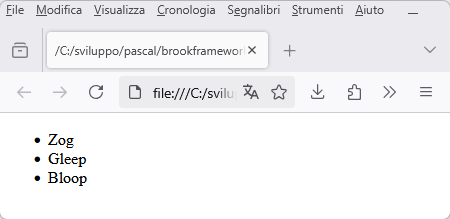
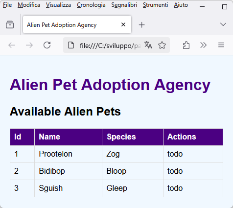

# Tutorial 2 - Un server CRUD con il framework Brook

Sviluppiamo insieme un server CRUD utilizzando la libreria [Brook](https://github.com/risoflora/brookframework).

La configurazione dell'ambiente di sviluppo è già stata descritta nel Tutorial 1.

## Adotta un animaletto alieno

Costruiremo le api per gestire un'agenzia di adozione di animaletti alieni.

Ogni animaletto avrà un nome, scelto dall'utente, ed una specie, scelta invece da un elenco di tre.

### Iniziamo a scrivere il codice...

Crea un nuovo progetto seguendo le indicazioni presenti nel Tutorial 1 e poi aggiungi al progetto una nuova unit: `modulealienpets`.

La prima route di cui avremo bisogno è quella che ci consentirà di compilare la tendina delle specie disponibili. La route risponderà ad una chiamata GET al percorso `/species`.

Nella unit aggiungi la classe `TRouteSpecies`:

``` pascal
  TRouteSpecies = class(TBrookURLRoute)
  protected
    procedure DoRequest(ASender: TObject; ARoute: TBrookURLRoute; ARequest: TBrookHTTPRequest; AResponse: TBrookHTTPResponse); override;
  public
    procedure AfterConstruction; override;
  end; 
```

ed implementa così i due metodi:

``` pascal
procedure TRouteSpecies.DoRequest(ASender: TObject; ARoute: TBrookURLRoute; ARequest: TBrookHTTPRequest; AResponse: TBrookHTTPResponse);
begin
 AResponse.Send('["Zog", "Gleep", "Bloop"]', 'application/json; charset=utf-8', 200);
end;

procedure TRouteSpecies.AfterConstruction;
begin
  Methods:= [rmGET];
  Pattern:= '/species';
end; 
```

Aggiungi la unit `httpserver` e crea una classe derivata da `TBrookHTTPServer` come già visto nel precedente tutorial. Nel costruttore del server andrà caricata la route `TRouteSpecies`.

Eseguendo il progetto e visitando l'url `https://localhost/species` questo sarà il risultato:


Funziona! Proviamo allora ad utilizzarlo dentro una pagina web di test che salveremo in un file `test.html`:

``` html
<!DOCTYPE html>
<html lang="en">
<body>
    <ul id="list">
    </ul> 
</body>
<script>
async function fetchSpecies() {
    try {
        const response = await fetch('https://localhost/species');
        if (!response.ok) {
            throw new Error('Network not working');
        }
        const species = await response.json();
        populateSpeciesList(species);
    } catch (error) {
        console.error('Error fetching species:', error);
    }
}

function populateSpeciesList(species) {
    const ul = document.getElementById('list');
    species.forEach(speciesItem => {
        const li = document.createElement("li");
        li.appendChild(document.createTextNode(speciesItem));
        ul.appendChild(li);
    });
}

fetchSpecies();

</script>
```

Aprendo il file nel browser quello che otterremo sarà una pagina completamente vuota!

Uno sguardo alla console di sviluppo del browser basterà per rendersi conto che il problema sono i controlli del browser sui criteri cross-origin:


### COOOOORRRRS!


Nel nostro server non abbiamo gestito le chiamate [CORS](https://en.wikipedia.org/wiki/Cross-origin_resource_sharing).

Se vogliamo che le api del nostro server siano accessibili da pagine che non provengono dal server stesso, come avviene con il nostro file `test.html` o come avverrebbe durante l'attività di sviluppo con Node.js e un framework come React, dovremo autorizzare le chiamate cors (magari con l'aiuto di una bella *define* fatta ad hoc se cors ci serve solo durante lo sviluppo).

Aggiungi una nuova unit `standardheaders` al progetto e definisci questa funzione:

``` pascal
procedure AddStandardHeaders(AResponse: TBrookHTTPResponse);
begin
  //{$IFDEF DEVELOPMENT}
  AResponse.Headers.Add('Access-Control-Allow-Origin', '*');
  //{$ENDIF}
end;
```

L'header inserito è proprio quello che serve per comunicare al browser che il nostro server è disposto a servire chiamate cross-origin.

Puoi utilizzare questa funzione per inserire altri header che potrebbero essere utili, ad esempio: 
``` pascal
AResponse.Headers.Add('Server', 'Alien puppies server');
```

Modifica la route:

``` pascal
procedure TRouteSpecies.DoRequest(ASender: TObject; ARoute: TBrookURLRoute; ARequest: TBrookHTTPRequest; AResponse: TBrookHTTPResponse);
begin
  AddStandardHeaders(aResponse);
  AResponse.Send('["Zog", "Gleep", "Bloop"]', 'application/json; charset=utf-8', 200);
end; 
```

Ora esegui il progetto e ricarica `test.html` nel broser, quello che vedrai è:



Benissimo! Finito col CORS? No.

L'header aggiunto è sufficiente ma solo se le chiamate CORS sono del  cosiddetto tipo [simple](https://developer.mozilla.org/en-US/docs/Web/HTTP/Guides/CORS#simple_requests). Purtroppo è necessario gestire richieste che il browser cataloga come [preflighted](https://developer.mozilla.org/en-US/docs/Web/HTTP/Guides/CORS#preflighted_requests) e quindi implementare la gestione del metodo http *OPTIONS*.

Facciamo una prova: cambia la porta del servizio da 443 a 5443 sia nel codice pascal sia nella pagina `test.html`. La chiamata diventerà preflighted ed il browser inizierà ad invocare il metodo OPTIONS. L'utilizzo di una porta diversa dallo standard è solo uno dei motivi per cui il browser può decidere di utilizzare la chiamata OPTIONS. Ce ne sono molti purtroppo.

Per risparmiarci mal di testa, implementiamo subito quanto manca per domare totalmente i criteri cors.

Riapri la unit `standardheaders` ed inserisci questa nuova procedura che aggiunge gli header necessari a soddisfare il browser nella risposta al metodo OPTIONS:

``` pascal
procedure AddStandardHeadersForOptions(AResponse: TBrookHTTPResponse; ARoute: TBrookURLRoute);
var
  mt, sep : String;
begin
  AddStandardHeaders(AResponse);

  if ARoute.Methods = [] then
    mt := 'GET, PUT, POST, OPTIONS, HEAD'
  else
  begin
    mt := '';
    sep  := '';
    if rmGet in ARoute.Methods then
    begin
      mt := mt + sep + 'GET';
      sep := ', ';
    end;
    if rmPOST in ARoute.Methods then
    begin
      mt := mt + sep + 'POST';
      sep := ', ';
    end;
    if rmPUT in ARoute.Methods then
    begin
      mt := mt + sep + 'PUT';
      sep := ', ';
    end;
    if rmDELETE in ARoute.Methods then
    begin
      mt := mt + sep + 'DELETE';
      sep := ', ';
    end;
    if rmPATCH in ARoute.Methods then
    begin
      mt := mt + sep + 'PATCH';
      sep := ', ';
    end;
    if rmOPTIONS in ARoute.Methods then
    begin
      mt := mt + sep + 'OPTIONS';
      sep := ', ';
    end;
    if rmHEAD in ARoute.Methods then
    begin
      mt := mt + sep + 'HEAD';
      sep := ', ';
    end;
  end;

  AResponse.Headers.Add('Access-Control-Allow-Methods', mt);
  AResponse.Headers.Add('Access-Control-Allow-Headers', 'x-requested-with, content-type, authorization');
end;
```

Ora aggiungi una nuova unit al progetto: `standardresponses`.

Dentro questa unit definisci il seguente metodo che ci sarà utile per evitare di riscrivere lo stesso codice in tutte le route:

``` pascal
function HandleOptions(ARequest : TBrookHTTPRequest; AResponse: TBrookHTTPResponse; ARoute : TBrookURLRoute): boolean;
begin
  Result := false;
  if ARequest.Method = 'OPTIONS' then
  begin
    AddStandardHeadersForOptions(AResponse, ARoute);
    AResponse.Send('', 'text/html', 200);
    Result := true;
  end;
end; 
```

Quasi finito... ora torna al codice della route `\species` e modifica il metodo `AfterConstruction` aggiungendo il metodo OPTIONS a quelli consentiti:
``` pascal
  Methods:= [rmGET, rmOPTIONS];
```

Modifica anche la funzione `DoRequest` in modo da aggiungere la gestione del metodo OPTIONS:
``` pascal
procedure TRouteSpecies.DoRequest(ASender: TObject; ARoute: TBrookURLRoute; ARequest: TBrookHTTPRequest; AResponse: TBrookHTTPResponse);
begin
  if HandleOptions(ARoute, ARequest, AResponse) then
    exit;
  AddStandardHeaders(aResponse);
  AResponse.Send('["Zog", "Gleep", "Bloop"]', 'application/json; charset=utf-8', 200);
end;  
```

Finito! Lancia il server e ricarica `test.html`: la pagina è tornata a funzionare anche con il servizio spostato sulla porta 5443.

## Finalmente CRUD

Aggiungi una nuova unit `alienpets` al progetto.

Nella unit definisci un nuovo tipo che ci servirà per rappresentare il singolo animaletto alieno (l'implementazione dei metodi non è volutamente riportata perchè dovrebbe essere piuttosto semplice):

``` pascal
  TAlienPet = class
  strict private
    FId : integer;
    FName : string;
    FSpecies : string;
  public
    constructor Create;
    procedure Clear;
    procedure Assign(const aSource : TAlienPet);
    procedure FromJson (aJsonData : TJSONData); overload;
    procedure FromJson (const aJsonString : string); overload;
    function ToJson: String; 

    property Id : integer read FId write FId;
    property Name : string read FName write FName;
    property Species : string read FSpecies write FSpecies;
  end; 
  ```

Devi anche creare una classe per memorizzare un elenco di animaletti che utilizzeremo nel server come repository in memoria dell'agenzia di adozione. L'accesso potrebbe essere concorrente quindi dovrai proteggere le operazioni di lettura/scrittura con una critical section:

``` pascal
  TAlienPetsArchive = class
  strict private
    FList : TObjectList;
    FCriticalSection : TCriticalSection;
    FLastId : integer;
    function Get(const aIndex : integer): TAlienPet;
  public
    constructor Create;
    destructor Destroy; override;
    function ToJson: String; // convert the archive to a json string

    procedure Add(const aAlienPet : TAlienPet); // add a pet to the archive
    procedure Delete (const aId : integer); // delete a pet from the archive by its own id
    procedure Update(const aSourceAlienPet : TAlienPet); // update a pet in the archive
    function GetNewId : integer; // generate a new unique id (for a newly created pet)
  end;


```

`GetNewId` è il metodo che dovrà fornire un id valido per i nuovi animaletti da memorizzare. Non abbiamo un database sotto il sedere e quindi dobbiamo arrangiarci... basterà un contatore globale che venga avanzato ad ogni inserimento.

Ora riapri `modulealienpets` perchè è il momento di creare una nuova route per recuperare gli animaletti disponibili.

Aggiungi sotto ad *implementation* la definizione di una nuova variabile globale di tipo `TAlienPetsArchive`:

``` pascal
var
  pets : TAlienPetsArchive;   
```

Aggiungi una funzione di comodo per inserire alcuni valori di test:

``` pascal
procedure InitAlienPetsArchive;
var
  tmp : TAlienPet;
begin
  tmp := TAlienPet.Create;
  tmp.Id:= 1;
  tmp.Name:= 'Prootelon';
  tmp.Species:= 'Zog';
  pets.Add(tmp);

  tmp := TAlienPet.Create;
  tmp.Id:= 2;
  tmp.Name:= 'Bidibop';
  tmp.Species:= 'Bloop';
  pets.Add(tmp);

  tmp := TAlienPet.Create;
  tmp.Id:= 3;
  tmp.Name:= 'Sguish';
  tmp.Species:= 'Gleep';
  pets.Add(tmp);
end; 
```

e crea e distruggi il nostro archivio nelle sezioni *initialization* e *finalization* della unit:

``` pascal
initialization
  pets := TAlienPetsArchive.Create;
  InitAlienPetsArchive;

finalization
  pets.Free;  
```

In questo modo avremo a disposizione un repository in memoria di animaletti alieni completo di qualche valore precaricato per iniziare subito a vedere qualcosa.

Ora aggiungi una nuova route alla unit:

``` pascal
  TRoutePetAliens = class(TBrookURLRoute)
  protected
    procedure DoRequest(ASender: TObject; ARoute: TBrookURLRoute; ARequest: TBrookHTTPRequest; AResponse: TBrookHTTPResponse); override;
  public
    procedure AfterConstruction; override;
  end; 
```

Questa route risponderà al percorso `/alienpets` restituendo l'elenco degli animaletti presenti in quel momento nel repository:

``` pascal
procedure TRoutePetAliens.DoRequest(ASender: TObject; ARoute: TBrookURLRoute; ARequest: TBrookHTTPRequest; AResponse: TBrookHTTPResponse);
begin
  if HandleOptions(ARoute, ARequest, AResponse) then
    exit;
  AddStandardHeaders(AResponse);
  AResponse.Send('{"pets":' + pets.ToJson + '}', 'application/json', 200);
end;

procedure TRoutePetAliens.AfterConstruction;
begin
  Methods:= [rmGET, rmOPTIONS];
  Pattern:= '/alienpets';
end; 
```

Aggiungi la route all'istanza di `THTTPServer` come visto nel tutorial 1.

Siamo pronti per imbastire la pagina della nostra agenzia di adozione!

Crea un file `index.html` fatto così:

``` html
<!DOCTYPE html>
<html lang="en">

<head>
    <meta charset="UTF-8">
    <meta name="viewport" content="width=device-width, initial-scale=1.0">
    <title>Alien Pet Adoption Agency</title>
    <style>
        body {
            font-family: Arial, sans-serif;
            background-color: #f0f8ff;
            margin: 0;
            padding: 20px;
        }

        h1 {
            color: #4b0082;
        }

        table {
            width: 100%;
            border-collapse: collapse;
            margin-top: 20px;
        }

        th,
        td {
            border: 1px solid #ddd;
            padding: 8px;
            text-align: left;
        }

        th {
            background-color: #4b0082;
            color: white;
        }

        button {
            margin-top: 10px;
        }
    </style>
</head>

<body>
    <h1>Alien Pet Adoption Agency</h1>

    <h2>Available Alien Pets</h2>
    <table id="petList">
        <thead>
            <tr>
                <th>Id</th>                
                <th>Name</th>
                <th>Species</th>                
                <th>Actions</th>
            </tr>
        </thead>
        <tbody>
            <!-- Pet items will be dynamically added here -->
        </tbody>
    </table>

    <script>
        const apiUrl = "https://localhost";               
        
        function displayPets(petsList) {
            const petList = document.getElementById('petList').getElementsByTagName('tbody')[0];
            petList.innerHTML = ''; // Clear existing pets
            petsList.pets.forEach((pet, index) => {
                const row = petList.insertRow();
                row.insertCell(0).innerText = pet.id;
                row.insertCell(1).innerText = pet.name;
                row.insertCell(2).innerText = pet.species;                
                row.insertCell(3).innerText = "todo";
            });
        }

        async function fetchPets() {
            try {
                const response = await fetch(apiUrl + "/alienpets", { mode: 'cors' });
                if (!response.ok) {
                    throw new Error('Network response was not ok');
                }
                const pets = await response.json();                
                displayPets(pets);
            } catch (error) {
                console.error('Error fetching species:', error);
            }
        }
        
        fetchPets();
    </script>
</body>
</html>
```

Attiva il server, carica il file nel browser e questo è quello che apparirà:



Ora possiamo creare una nuova route per gestire le operazioni di inserimento, modifica e cancellazione.

Nella unit `modulealienpets` aggiungi la route:

``` pascal
  TRoutePetAlien = class(TBrookURLRoute)
  strict private
    procedure Post(ARoute: TBrookURLRoute; ARequest: TBrookHTTPRequest; AResponse: TBrookHTTPResponse);
    procedure Put(ARoute: TBrookURLRoute; ARequest: TBrookHTTPRequest; AResponse: TBrookHTTPResponse);
    procedure Delete(const aPetId: integer; ARoute: TBrookURLRoute; ARequest: TBrookHTTPRequest; AResponse: TBrookHTTPResponse);
  protected
    procedure DoRequest(ASender: TObject; ARoute: TBrookURLRoute; ARequest: TBrookHTTPRequest; AResponse: TBrookHTTPResponse); override;
  public
    procedure AfterConstruction; override;
  end;
```

E' già evidente che sfrutteremo i metodi http per recepire le diverse operazioni da compiere. Compila il metodo `AfterConstruction` in questo modo:

``` pascal
procedure TRoutePetAlien.AfterConstruction;
begin
  Methods:= [rmPOST, rmPUT, rmDELETE, rmOPTIONS];
  Pattern := 'alienpet(([/])|(/[0-9]+))?';
end;
```

Il metodo POST servirà per l'inserimento, il metodo PUT per l'aggiormento, il metodo DELETE per la cancellazione e il già conosciuto OPTIONS per gestire le chiamate cors.

Come vedi la proprietà pattern si è fatta più complicata rispetto alla precedente route. Il framework Brooks implementa il match del routing appoggiandosi alle espressioni regolari *PCRE2* e qui abbiamo bisogno di una espressione regolare per fare in modo che la route risponda quando invocata come:
  * /alienpet o /alienpet/ per le chiamate POST, PUT, OPTIONS
  * /alienpet/123 per le chiamate DELETE dove 123 è l'id dell'animaletto alieno da eliminare

Un buon sito per fare il test delle regex è questo: https://www.debuggex.com/?flavor=pcre mentre la documentazione di PCRE è facilmente recuperabile in rete.

Se questo non fosse un sito semplificato, molto probabilmente avresti bisogno di implementare anche il metodo GET che qui invece è omesso.

Devi ora compilare la `DoRequest` in questo modo:

``` pascal
procedure TRoutePetAlien.DoRequest(ASender: TObject; ARoute: TBrookURLRoute; ARequest: TBrookHTTPRequest; AResponse: TBrookHTTPResponse);
var
  tmpId : integer;
begin
  if HandleOptions(ARoute, ARequest, AResponse) then
    exit;
  AddStandardHeaders(AResponse);

  tmpId := 0;
  if (Length(ARoute.Segments) >= 1) then
    tmpId := StrToInt(RightStr(ARoute.Segments[Length(ARoute.Segments)-1], Length(ARoute.Segments[Length(ARoute.Segments)-1]) - 1 ));

  if ARequest.Method = 'POST' then
    Post(ARoute, ARequest, AResponse)
  else if ARequest.Method = 'PUT' then
    Put(ARoute, ARequest, AResponse)
  else if ARequest.Method = 'DELETE' then
    Delete(tmpId, ARoute, ARequest, AResponse);
end;
```

`tmpId`contiene l'eventuale id passato nella url della chiamata. I segmenti della URL possono essere estratti dalla proprietà `Segments` dell'istanza corrente della `TBrookURLRoute`.

Ora compila la procedura di gestione del POST:

``` pascal
procedure TRoutePetAlien.Post(ARoute: TBrookURLRoute; ARequest: TBrookHTTPRequest; AResponse: TBrookHTTPResponse);
var
  jData : TJSONData;
  newAlien : TAlienPet;
begin
  if ARequest.Payload.Text <> '' then
  begin
    jData := GetJSON(ARequest.Payload.Text);
    try
      newAlien := TAlienPet.Create;
      ReadAlienFromJson(jData, newAlien);
      newAlien.Id:= pets.GetNewId;
      pets.Add(newAlien);
    finally
      jData.Free;
    end;
    AResponse.Send(newAlien.ToJson, 'application/json', 200);
  end
  else
    AResponse.Send('Invalid request', 'text/plain', 400);
end;
```

I dati del nuovo animaletto verranno passati nel payload della chiamata. E' importante notare come il browser chiamante si aspetti di ricevere un codice 200 se tutto è filato liscio e la consuetudine dice anche di restituire un codice 400 se qualcosa invece non fosse andato bene.

La procedura di gestione della DELETE risulta molto più semplice:

``` pascal
procedure TRoutePetAlien.Delete(const aPetId: integer; ARoute: TBrookURLRoute; ARequest: TBrookHTTPRequest; AResponse: TBrookHTTPResponse);
begin
  pets.Delete(aPetId);
  AResponse.Send('deleted ' + IntToStr(aPetId), 'text/plain', 200);
end;
```

Anche lei dovrà ritornare un codice 200 al chiamante.

La procedura di gestione del PUT è molto simile a quella del POST per cui non verrà riportata qui.

La nuova route andrà aggiunta alla classe `THTTPServer` come fatto in precedenza per la route `/alienpets`.

Il server è così pronto!

Modifica il file `index.html` aggiungendo nel `body` sopra la `table` queste due `form`, una per l'inserimento e una per la modifica (ne utilizziamo due diverse per semplicità):

``` html
    <h2>Add a New Alien Pet</h2>
    <form id="addPetForm">
        <input type="text" id="petName" placeholder="Pet Name" required>
        <select id="petSpecies" required>
            <option value="">Select Species</option>
            <!-- Species options will be dynamically added here -->
        </select>
        <button type="submit">Add Pet</button>
    </form>

    <h2>Edit an Existing Alien Pet</h2>
    <form id="updatePetForm">
        <input type="text" id="petIdForUpdate" readonly="true">
        <input type="text" id="petNameForUpdate" placeholder="Pet Name" required>
        <select id="petSpeciesForUpdate" required>
            <option value="">Select Species</option>
            <!-- Species options will be dynamically added here -->
        </select>
        <button type="submit">Update Pet</button>
    </form>
```

Al fondo della pagina aggiungi queste funzioni javascript:

``` javascript
async function fetchSpecies() {
    try {
        const response = await fetch(apiUrl + "/species", { mode: 'cors' });
        if (!response.ok) {
            throw new Error('Network response was not ok');
        }
        const species = await response.json();
        populateSpeciesDropdown(species);
    } catch (error) {
        console.error('Error fetching species:', error);
    }
}

function populateSpeciesDropdown(species) {
    const speciesDropdown = document.getElementById('petSpecies');
    const speciesDropdownForUpdate = document.getElementById('petSpeciesForUpdate');
    species.forEach(speciesItem => {
        const option = document.createElement('option');
        option.value = speciesItem;
        option.textContent = speciesItem;
        speciesDropdown.appendChild(option);

        const optionForUpdate = document.createElement('option');
        optionForUpdate.value = speciesItem;
        optionForUpdate.textContent = speciesItem;
        speciesDropdownForUpdate.appendChild(optionForUpdate);
    });
}
```

Ci serviranno per popolare le combobox con le specie disponibili per i nostri animaletti. Il codice è molto molto simile a quello già visto nel tutorial 1.

Nella definizione della tabella sostituisci a questa riga
```
row.insertCell(3).innerText = "todo";
```
quest'altra:
``` javascript
const actionsCell = row.insertCell(3);
actionsCell.innerHTML = `<button onclick="editPet(${pet.id}, '${pet.name}', '${pet.species}')">Edit</button>
<button onclick="deletePet(${pet.id})">Delete</button>`;
```

Così facendo aggiungiamo due pulsanti su ogni riga della tabella degli animaletti: uno per la modifica e uno per la cancellazione.


Ora una bella iniezione di funzioni javascript per invocare i metodi del server CRUD:

``` javascript
async function deletePet(id) {
    try {
        const response = await fetch(apiUrl + "/alienpet/" + id, { method: 'DELETE'});
        if (!response.ok) {
            throw new Error('Network response was not ok');
        }
        console.log('Pet deleted:', id);
        fetchPets(); // Refresh the pet list after adding
    } catch (error) {
        console.error('Error deleting pet:', error);
    }
}

async function putUpdatedPet(updatedPet) {
    try {
        const response = await fetch(apiUrl + "/alienpet", {
            method: 'PUT',
            headers: {
                'Content-Type': 'application/json'
            },
            body: JSON.stringify(updatedPet)
        });
        if (!response.ok) {
            throw new Error('Network response was not ok');
        }
        const result = await response.json();
        console.log('Pet updated:', result);
        fetchPets(); // Refresh the pet list after adding
    } catch (error) {
        console.error('Error updating pet:', error);
    }
}

function editPet(id, name, species) {
    document.getElementById('petIdForUpdate').value = id;
    document.getElementById('petNameForUpdate').value = name;
    document.getElementById('petSpeciesForUpdate').value = species;
}

async function postNewPet(newPet) {
    try {
        const response = await fetch(apiUrl + "/alienpet", {
            method: 'POST',
            headers: {
                'Content-Type': 'application/json'
            },
            body: JSON.stringify(newPet)
        });
        if (!response.ok) {
            throw new Error('Network response was not ok');
        }
        const result = await response.json();
        console.log('Pet added:', result);
        fetchPets(); // Refresh the pet list after adding
    } catch (error) {
        console.error('Error adding pet:', error);
    }
}
```

e in coda alla sezione `<script>`:

``` javascript
document.getElementById('addPetForm').addEventListener('submit', function (event) {
    event.preventDefault();
    const newPet = {
        id: 0,
        name: document.getElementById('petName').value,
        species: document.getElementById('petSpecies').value
    };
    postNewPet(newPet);
    this.reset(); // Clear the form
});

document.getElementById('updatePetForm').addEventListener('submit', function (event) {
    event.preventDefault();
    const updatedPet = {
        id: document.getElementById('petIdForUpdate').value,
        name: document.getElementById('petNameForUpdate').value,
        species: document.getElementById('petSpeciesForUpdate').value
    };
    putUpdatedPet(updatedPet);
    this.reset(); // Clear the form
});

fetchSpecies();
fetchPets();
```
La nostra pagina html è pronta per interagire col server quindi esegui il server e carica la pagina nel browser!

Eccola in azione:


## Cosa abbiamo visto
  * come utilizzare il framework Brook per creare un server crud:
    * come supportare la modalità cors in fase di sviluppo
    * come implementare una route per operazioni CRUD con metodi multipli e parametri nel path

## Dove trovare il codice sorgente
Il codice sorgente di questo tutorial è disponibile a questo indirizzo: [https://github.com/DomenicoMammola/brookframework_tutorials](https://github.com/DomenicoMammola/brookframework_tutorials)
  